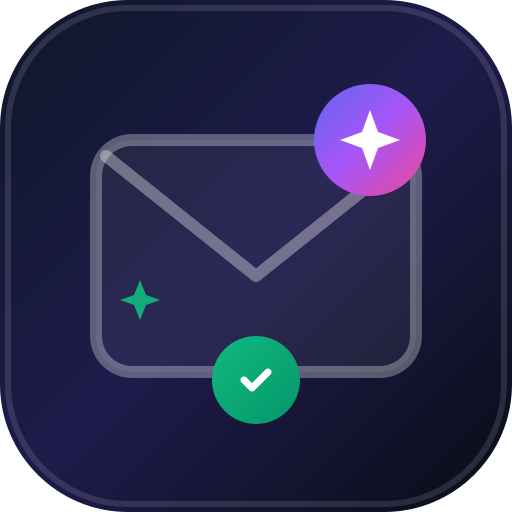

# 📬 MailCleaner - Mobile App (iOS & Android)

**MailCleaner** è un'applicazione mobile intelligente cross-platform (iOS, Android, PWA) per la gestione centralizzata e la pulizia automatica programmata di caselle email multiple (**Gmail**, **Libero Mail**, **Outlook**, **IMAP personalizzati**).



---

## ✨ Funzionalità Principali

* 🌐 **Multi-Account Hub:** Connetti caselle **Gmail** (OAuth 2.0), **Outlook** (Microsoft Graph), **Libero Mail** (IMAP SSL porta 993) e server IMAP personalizzati.
* ⚙️ **Filtri & Regole Intelligenti:**
  - **Filtro Anzianità:** Elimina messaggi più vecchi di 7, 14, 30, 60 o 90 giorni.
  - **Filtro Mittenti/Domini:** Supporto wildcard (es. `*@newsletter.*`, `*@promo.*`).
  - **Filtro Parole Chiave:** Rileva "Sconto", "Offerta", "Saldi", "Coupon", ecc.
  - **Whitelist di Sicurezza Automatica:** Protezione per ricevute, fatture, avvisi bancari e messaggi con stella (⭐).
* 🛡️ **Cestino Sicuro & Ripristino Istantaneo:** Modalità predefinita cautelativa con conservazione 30 giorni e ripristino con 1 click nella cartella Inbox.
* ⚡ **Pulizia Automatica Giornaliera (Cron Notturno):** Pianificazione oraria personalizzata (es. 03:00 AM) con report dettagliato.
* 📊 **Dashboard & Statistiche:** Monitoraggio email rimosse, spazio liberato in MB/GB e registro cronologico (Audit Log).
* 📱 **Supporto Completo Mobile:** PWA installabile con 1-click + progetti nativi Android (APK) e iOS (Xcode / Capacitor).

---

## 🚀 Come Eseguire Localmente

```bash
# 1. Clona il repository
git clone https://github.com/giovannicatarisano/mailcleaner-app.git
cd mailcleaner-app

# 2. Installa le dipendenze
npm install

# 3. Avvia il server di sviluppo
npm run dev
```

L'app sarà accessibile su `http://localhost:5173/`.

---

## 📱 Compilazione Nativa (Android & iOS)

### Per Android:
```bash
npm run build
npx cap sync android
npx cap open android
```
*(Apri in **Android Studio** e compila il file `.apk` da `Build -> Build Bundle(s) / APK(s)`)*

### Per iOS:
```bash
npm run build
npx cap sync ios
npx cap open ios
```
*(Apri in **Xcode** su macOS per eseguire o firmare il progetto)*

---

## 📄 Licenza
Progetto distribuito sotto licenza MIT.